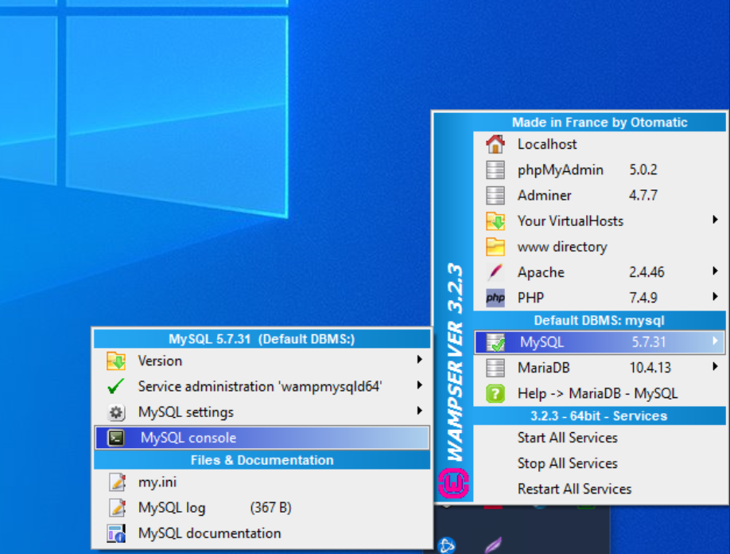

O projeto segue com as funcionalidade de um CRUD.
Cadastrando clientes em um usuario logado.
Para iniciar o projeto é necessário:

1- Possuir um servidor wampserver que pode ser baixado no link:
  https://sourceforge.net/projects/wampserver/ 

2- Rode o console do mySQL e cole o script do Arquivo "database" na pasta do projeto preenchendo o banco e fazendo o insert do usuário.  

 

3- Para rodar o projeto os arquivos precisam estar localizados na pasta do servidor que se encontram no caminho "C:\wamp64\www\"  

4-  

 
