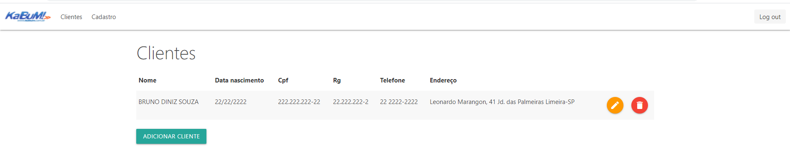

O projeto segue com as funcionalidade de um CRUD.
Cadastrando clientes em um usuario logado.
Para iniciar o projeto é necessário:

1- Possuir um servidor wampserver que pode ser baixado no link:
  https://sourceforge.net/projects/wampserver/ 

2- Rode o console do mySQL e cole o script do Arquivo "database" na pasta do projeto preenchendo o banco e fazendo o insert do usuário.  

 

3- Para rodar o projeto os arquivos precisam estar localizados na pasta do servidor que se encontram no caminho "C:\wamp64\www\"  

 

4- Agora basta acessar o servidor local atraves da url http://localhost/kabum/index.php 

5- Para fazer o login use o usuario "admin" e a senha "1234" 

 
 

5- Após logado vc estará na url http://localhost/kabum/clientes.php onde é listado os clientes cadastrados, clique no botão "adicionar cliente para cadastrar um novo." 

 

6- Na tela de cadastro insira os dados e clique em "Cadastrar":" 

 
 

7- Para editar ou excluir basta clicar nos botões laranja e vermelho respectivamente." 

 
